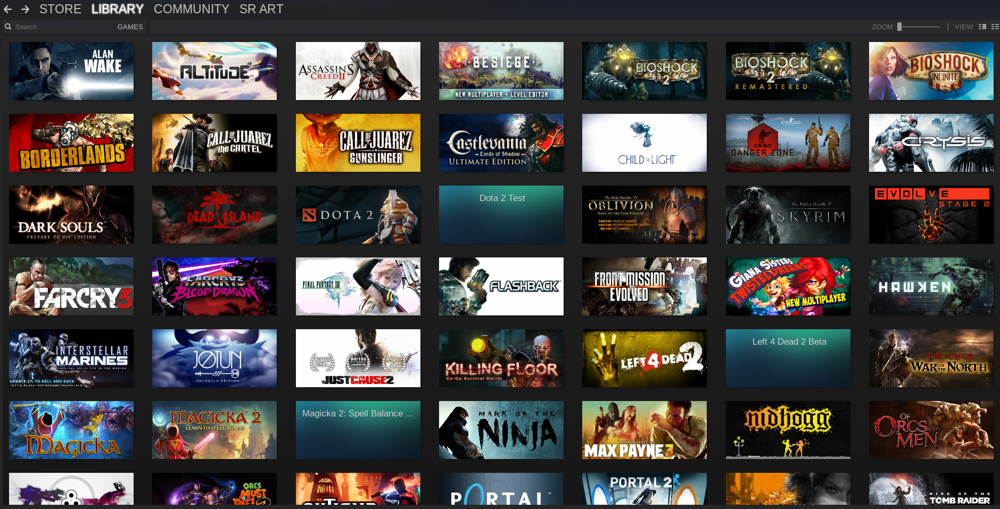
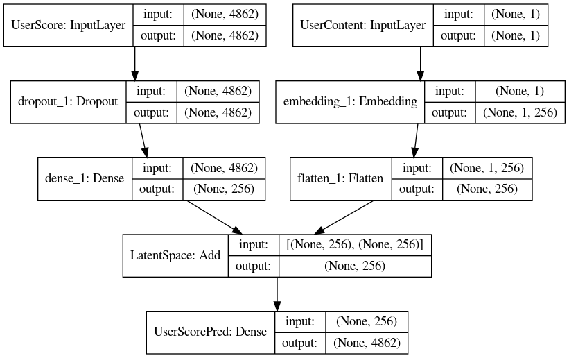
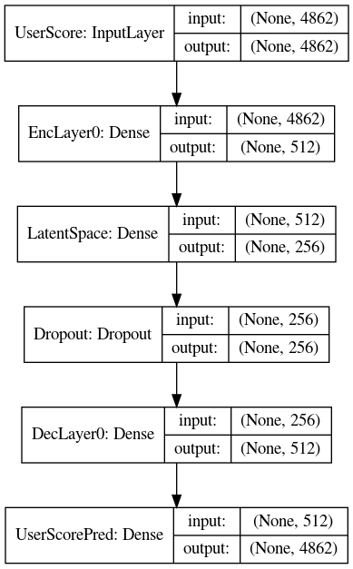
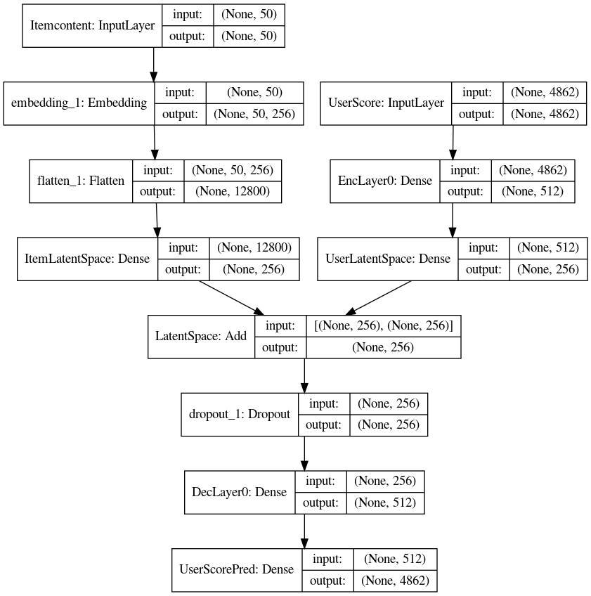
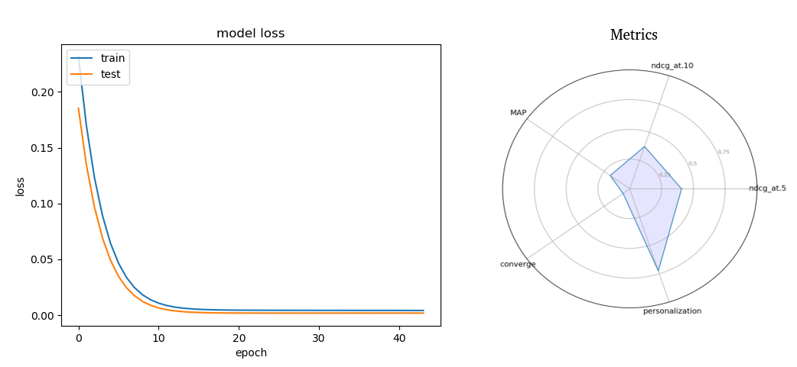
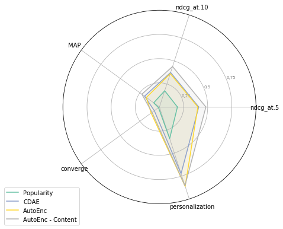

# Deep AutoEncoders for Collaborative Filtering

Collaborative Filtering is a method used by recommender systems to make predictions about an interest of an specific user by collecting taste or preferences information from many other users. The technique of Collaborative Filtering has the underlying assumption that if a user A has the same taste or opinion on an issue as the person B, A is more likely to have B’s opinion on a different issue. 

**This project implements different Deep Autoencoder for Collaborative Filtering for Recommendation Systems in Keras** based on different articles. The test case uses the Steam Platform interactions dataset to recommend games for users.



* [Requirements](#requirements)
* [Getting Started](#getting-started)
  * Datasets
  * Data Preparation
  * Model Training
  * Recommender
* [Implemented Recommender Models](#implemented-recommender-models)
  * Popularity Model
  * CDAE - Collaborative Denoising Auto-Encoders for Top-N Recommender Systems
  * Deep AutoEncoder for Collaborative Filtering
  * Deep AutoEncoder for Collaborative Filtering With Content Information
* [Rerefences](#rerefences)

## Requirements

Create a conda env from ```conda.yaml```

* python=3.6
* keras=2.1.5
* tensorflow==1.7.0  
* mlflow
* pandas=0.22.0
* scikit-learn=0.19.1
* cloudpickle=0.6.1
* numpy=1.14.3
* seaborn=0.9
* click=6.7
* scipy=1.0.1
* graphviz
* pydotplus

## Getting Started

This project uses [MLflow](https://www.mlflow.org) for reproducibility, model training and dependency management. Install mlflow before:

```
$ pip install mlflow
```

```
$ git clone https://github.com/marlesson/recsys_autoencoders.git
```

### Datasets

The dataset used in this project is Steam-Vide-Games obtained from https://www.kaggle.com/tamber/steam-video-games.

This dataset is a list of user behaviors, with columns:`user_id`, `game`, `type`, `hours`, `none`. The type included are 'purchase' and 'play'. The value indicates the degree to which the behavior was performed - in the case of 'purchase' the value is always 1, and in the case of 'play' the value represents the number of hours the user has played the game.

`./data/raw/rating.csv`

| user_id  | game | type | hours | none |
| -------- | ---------------- | ---------------- | ----------- |  ------------ |
| 151603712 | "The Elder Scrolls V Skyrim" | purchase | 1.0 | 0 |
| 151603712 | "The Elder Scrolls V Skyrim" | play | 273.0 | 0 |
| 151603712 | "Fallout 4" | purchase | 1.0 | 0 |
| ... | ... | ... | ... | ... |


### Data Preparation

The data preparation process transforms the original dataset, groups the implicit feedbacks and interactions, and creates specific datasets for training and model testing.

```
$ mlflow run . -e data_preparation -P min_interactions=5 -P test_size=0.2
```

Datasets created:
* ./data/articles_df.csv
* ./data/interactions_full_df.csv
* ./data/interactions_train_df.csv (Subset of 'interactions_full_df.csv' for train)
* ./data/interactions_test_df.csv (Subset of 'interactions_full_df.csv' for test)

`articles_df.csv` contain the data exclusively of the items (games).

| content_id  | game | total_users | total_hours |
| -------- | ---------------- | ---------------- | ----------- | 
| 0 | 007 Legends | 1 | 1.7 |
| 1 | 0RBITALIS | 3 | 4.2 |

`interactions_full_df.csv` contain the data of interactions between user X item, amount of hours played (hours) and played (view) as implicit feedback.

| user_id | content_id | game | hours | view | 
| -------- | ---------------- | ---------------- | ----------- |  ----------- | 
| 134  | 1680 | Far Cry 3 Blood Dragon | 2.2 | 1 |
| 2219 | 1938 | Gone Home | 1.2 | 1 |
| 3315 | 3711 | Serious Sam 3 BFE | 3.7 | 1 |

### Model Training

Parameter ```--name``` indicates the model to be trained. Depending on the model some parameters have no effect.

```
Usage: mlflow run . [OPTIONS]

  Train Autoencoder Matrix Fatorization Model

Options:
  --name [auto_enc|cdae|auto_enc_content]
  --factors INTEGER
  --layers TEXT
  --epochs INTEGER
  --batch INTEGER
  --activation [relu|elu|selu|sigmoid]
  --dropout FLOAT
  --lr FLOAT
  --reg FLOAT
```

#### Implemented Recommender Models

**This is an adapted implementation of the original article, simplifying some features for a better understanding of the models.**

##### 1. Popularity Model

This model makes recommendations using the most popular games, the ones that had the most purchases in a period. This recommendation is not personalized, that is, it is the same for all users

This is a Base Model that will be used to compare with AutoEncoders Models. 

Run training:
```
$ mlflow run . -e popularity_train
```

##### 2. CDAE - Collaborative Denoising Auto-Encoders for Top-N Recommender Systems

> Yao Wu, Christopher DuBois, Alice X. Zheng, Martin Ester. 
> Collaborative Denoising Auto-Encoders for Top-N Recommender Systems.
> The 9th ACM International Conference on Web Search and Data Mining (WSDM'16), p153--162, 2016.  
> http://alicezheng.org/papers/wsdm16-cdae.pdf

Run training:
```
$ mlflow run . \
          -P activation=selu \
          -P batch=64 \
          -P dropout=0.8 \
          -P epochs=50 \
          -P factors=500 \
          -P lr=0.0001 \
          -P name=cdae \
          -P reg=0.0001
```



##### 3. Deep AutoEncoder for Collaborative Filtering

> KUCHAIEV, Oleksii; GINSBURG, Boris. 
> Training deep autoencoders for collaborative filtering. 
> arXiv preprint arXiv:1708.01715, 2017. 
> https://arxiv.org/pdf/1708.01715.pdf

Run training:
```
$ mlflow run . \
          -P activation=selu \
          -P batch=64 \
          -P dropout=0.8 \
          -P epochs=50 \
          -P layers='[512,256,512]' \
          -P lr=0.0001 \
          -P name=auto_enc_content \
          -P reg=0.01
```



##### 4. Deep AutoEncoder for Collaborative Filtering With Content Information

This model is an adaptation of the model presented previously, but adding content information. In this way the model is a Hybrid implementation.

In this model I add the 'game name' of all games that the user has already played as additional information for collaborative filtering. This is a way to add content information to the user level.

```
$ mlflow run . \
          -P activation=selu \
          -P batch=64 \
          -P dropout=0.8 \
          -P epochs=50 \
          -P layers='[512,256,512]' \
          -P lr=0.0001 \
          -P name=auto_enc \
          -P reg=0.01
```



#### Training Results

After the trained model, the artifacts (model, metrics, graphics, logs) will be saved in `./mlruns/0/<UID>/`



If you want to run the training for all models, run the script `$ ./train_all.sh`

### Evaluation

All models were evaluated with different RecSys metrics. After train use Mlflow to view metrics in UI.

```
$ mlflow ui
```




### Recommender

Uses a trained AutoEncoder (`--model_path`) to recommend games for the user (´--user_id´).

```
Usage: mlflow run . -e recommender [OPTIONS]

  Recommender Matrix Fatorization Model

Options:
  --name    [auto_enc|cdae|auto_enc_content]
  --model_path TEXT
  --user_id INTEGER
  --topn    INTEGER
  --view    INTEGER (Recommend items already viewed)
  --output  TEXT
```

```
$ mlflow run . -e recommender \
          -P name='auto_enc' \
          -P model_path='mlruns/0/<UID>/artifacts/auto_enc' \
          -P topn=10 \
          -P view=0 \
          -P user_id=25

...

      score  content_id                             game
0  1.029705        2457                    Left 4 Dead 2
1  1.013235        2326                     Just Cause 2
2  0.979504         975  Counter-Strike Global Offensive
3  0.979452        4675                          Trine 2
4  0.909918        2355                    Killing Floor
5  0.904026        2690                       Metro 2033
6  0.897048        2063         Half-Life Opposing Force
7  0.892517        2061             Half-Life Blue Shift
8  0.857984        4240                         Terraria
9  0.840588        2055                      Half-Life 2
```

## Rerefences

* https://www.kaggle.com/gspmoreira/recommender-systems-in-python-101
* https://github.com/statisticianinstilettos/recmetrics/blob/master/recmetrics/metrics.py
* https://github.com/benfred/implicit/
* https://github.com/NVIDIA/DeepRecommender